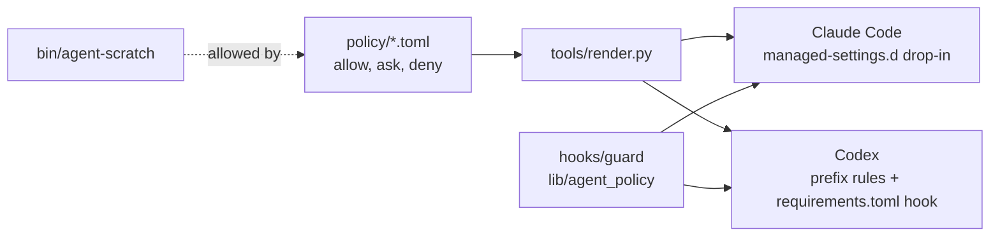

# agent-policy

[](LICENSE.md)
[](https://github.com/ivan-pinatti-labs/agent-policy/issues)
[](https://github.com/sponsors/ivan-pinatti)
[](https://github.com/ivan-pinatti-labs/agent-policy)
[](https://github.com/ivan-pinatti-labs/agent-policy/forks)
[](https://coderabbit.ai)
[](https://sonarcloud.io/project/overview?id=ivan-pinatti-labs_agent-policy)

One command policy for coding agents, written once and installed for
**Claude Code** (every profile) and **Codex**. Every command the policy lists
carries a severity, and the severity decides what the agent does:

| Severity               | Decision | Examples                                                                                                                                         |
| ---------------------- | -------- | ------------------------------------------------------------------------------------------------------------------------------------------------ |
| **read**, **low**      | allow    | reading anything; `git add/commit/push/rebase`; the pull request flow; `podman build/run/exec`; `terraform plan`; `agent-scratch`                |
| **moderate**, **high** | ask      | `podman rm`; `gh api` writes; `curl -X POST`; `git reset --hard`, `branch -D`; `kubectl apply`; `terraform apply`; reading a secret value        |
| **severe**             | deny     | force push, deleting a remote branch, `git filter-repo`, `terraform destroy`, `rm -rf ~`, `aws s3 rb --force`, touching a protected deployment   |
| **critical**           | deny     | reading or writing a credential file, `--no-verify`, a git hook bypass, mounting the engine socket or `~/.ssh` into a container, `gh auth token` |

- **allow** runs with no prompt.
- **ask** is the agent's normal permission prompt.
- **deny** is a hand-off: the agent is refused and told to ask you to run the
  command yourself (`! <command>`). `severe` is irreversible or destructive;
  `critical` exposes credentials, defeats a safety gate, or can take over the
  host or agent. See [docs/POLICY.md](docs/POLICY.md) for the full scale.

Anything the policy does not name is left to the agent: Claude Code's auto
mode classifier or its prompt, Codex's sandbox and approval policy.

It also ships `agent-scratch`, a scratchpad where an agent can create and
remove its own containers, networks, volumes and files without prompts, and
without being able to touch anything it did not create.

## Requirements

- Linux, with Python 3.11 or newer as the system `python3` (the guard and
  `agent-scratch` use the standard library only).
- [Claude Code](https://code.claude.com/docs) and/or
  [Codex](https://developers.openai.com/codex), the agents being governed.
- Rootless [Podman](https://podman.io/), for `make test`, `make build`,
  `make harvest` and `agent-scratch`.
- `sudo`, once per install or update: the policy goes into system folders
  so that agents cannot edit it.
- For development, [pre-commit](https://pre-commit.com/#install) and a
  `docker` command (Docker, or Podman's `podman-docker` compatibility
  package): two hooks, actionlint and hadolint, run their linters as
  containers through it. A [devcontainer-airlock](.devcontainer/README.md)
  workbench carries both.

## Usage

```shell
git clone https://github.com/ivan-pinatti-labs/agent-policy.git
cd agent-policy
make test      # the suite, in its own container
make install   # backs up what it touches, then installs for both agents (sudo)
```

| You want to                                   | Run                         |
| --------------------------------------------- | --------------------------- |
| see the targets                               | `make`                      |
| update this machine to the latest policy      | `git pull && make install`  |
| see what an install would change              | `make diff`                 |
| find local rules worth promoting, or deleting | `make harvest`              |
| remove everything                             | `make uninstall`            |
| list the automatic backups                    | `make backups`              |
| undo an install or uninstall                  | `make restore BACKUP=<dir>` |

Then, once per machine:

- List any live deployment agents must never stop or exec into, one folder
  per line, in `~/.config/agent-policy/protected-paths`
  ([docs/OPERATIONS.md](docs/OPERATIONS.md#protected-deployments)).
- Tell the agents about the hand-off and the scratchpad in your global
  instructions ([docs/OPERATIONS.md](docs/OPERATIONS.md#telling-agents-about-it)).

An agent working in a project then uses the scratchpad like this:

```shell
agent-scratch network demo net --internal
agent-scratch run demo --name db -d --network as-demo-net postgres:17
agent-scratch exec demo db psql -U postgres -c 'select 1'
agent-scratch purge demo
```

## How it works



Two layers, because neither agent's rule language can say everything:

- **Static rules** decide by command prefix (`git push`, `podman rm`,
  `terraform apply`). They are written once in `policy/*.toml` and rendered
  into each agent's own format. Claude also gets glob rules for what a
  prefix cannot say (`Bash(*git*push*--force*)`, `Bash(aws * describe-*)`).
- **The guard** is one PreToolUse hook that both agents run before every
  shell command. It reads the whole line, looking through `&&`, pipes,
  `$(...)`, `bash -c` and wrappers such as `timeout`, `env` and `xargs`.
  It speaks up only when it finds something a prefix cannot see: a force
  flag at the end of the line, a request body on `curl`, a container that
  mounts the home folder, a container that belongs to a protected
  deployment.

Codex prefix rules cannot forbid `git push origin main --force` while
allowing `git push origin main`; `tests/codex_cases.toml` records exactly
that, and the guard is what closes the gap.
[docs/ARCHITECTURE.md](docs/ARCHITECTURE.md) has the details, including how
each agent receives the policy and what differs between them.

## Repository layout

| Path                                                                       | What                                                                          |
| -------------------------------------------------------------------------- | ----------------------------------------------------------------------------- |
| [policy/](policy/)                                                         | The rules, one TOML file per area. Format in [docs/POLICY.md](docs/POLICY.md) |
| [hooks/guard](hooks/guard)                                                 | The PreToolUse hook both agents run                                           |
| [lib/agent_policy/](lib/agent_policy/)                                     | Command parsing and the checks the guard and `agent-scratch` share            |
| [bin/agent-scratch](bin/agent-scratch)                                     | The scratchpad helper ([docs/SCRATCHPAD.md](docs/SCRATCHPAD.md))              |
| [tools/render.py](tools/render.py)                                         | Renders `policy/` into each agent's native files under `dist/`                |
| [tools/collect.sh](tools/collect.sh), [tools/harvest.py](tools/harvest.py) | `make harvest`: compare this machine's permission files with the policy       |
| [tests/](tests/)                                                           | Table driven cases for the guard and for Codex, plus the test image           |
| [docs/](docs/)                                                             | Architecture, policy format, scratchpad, operations, merge pipeline           |

## Documentation

- [docs/ARCHITECTURE.md](docs/ARCHITECTURE.md): the two layers, how each
  agent receives them, what the guard checks and how it reads a command.
- [docs/POLICY.md](docs/POLICY.md): the tiers, the rule format, and how to
  change a rule.
- [docs/SCRATCHPAD.md](docs/SCRATCHPAD.md): `agent-scratch`, what it allows
  and what it refuses.
- [docs/OPERATIONS.md](docs/OPERATIONS.md): installing, updating in both
  directions, harvesting, protected deployments, uninstalling.
- [docs/MERGE_PIPELINE.md](docs/MERGE_PIPELINE.md): how a pull request
  merges here (shared with the other `ivan-pinatti-labs` repositories).

## License

See [LICENSE.md](LICENSE.md) for full details.

## Contribute / Donate

If you use this project, entirely or partially, or get inspired by it,
consider buying me a coffee or a beer, I would really appreciate it:
[buymeacoffee.com/ivan.pinatti](https://www.buymeacoffee.com/ivan.pinatti).
