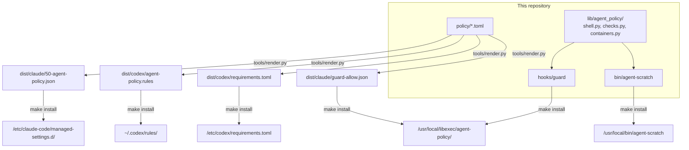

# Architecture

agent-policy has two layers, static rules and a guard hook, delivered to two
agents that express permissions very differently. This document explains
why both layers exist, how each agent receives them, and how the guard reads
a command.

## The two layers

**Static rules** match a command by its leading words. They are cheap,
every agent understands some form of them, and they cover most decisions:
`git status` is fine, `podman rm` asks, `terraform destroy` is handed to the
user.

**The guard** assigns a severity (the scale in [POLICY.md](POLICY.md)) to
what a prefix cannot see, and the strictest finding wins:

- a flag after the first position (`git push origin main --force`,
  `git push -uf`, the refspec `+main`, `curl ... -XPOST`,
  `gh api ... -f title=x`, which makes `gh` send a POST);
- environment or git config that changes behavior (`HUSKY=0`, `SKIP=...`,
  `git -c core.hooksPath=...`, `-c core.sshCommand=...`, `--config-env`);
- reading a credential path through any reader, copy, move, sync or archive
  tool (`cat`, `base64`, `cp`, `mv`, `rsync`, `scp`, `dd`, `tar`, `zip`...),
  which is `critical` even though `cat` and `cp` are allowed in general;
- writing a credential file, a shell startup file, a git hook or a PATH
  directory, through a redirect, `cp`, `tee`, `curl -o`, `podman cp` or an
  in-place editor;
- what a container run would reach (`--privileged`, host or `container:`
  namespaces, `--cap-add`, `--device`, `--volumes-from`, `--secret`,
  `--rootfs`, a bind mount of the home folder, a credential folder or the
  engine socket, or a mount path with an unexpanded variable);
- the operation an `aws` command performs (a write verb mid-line, an
  irreversible call, or one that returns a secret value);
- who a container belongs to (the guard asks the engine, so it can refuse
  `podman stop` on a protected deployment by name);
- recursive removal of the home folder, credentials or a protected
  deployment;
- every redirection target: an output redirect is judged like any other
  write, an input redirect from a credential path like any other read, and
  a redirect to `/dev/tcp` or `/dev/udp` (a network socket) asks;
- mounts (`mount`, `umount`, `bindfs`, `sshfs`, `rclone mount`): exposing a
  credential folder at another path, or mounting over a credential, a
  startup file, a PATH directory or the home folder, is refused, and so is
  any mount or unmount inside a protected deployment.

The two overlap on purpose. Claude gets glob rules for force push too, so a
force push is refused even if the guard is not installed or fails.

## The third layer: the sandbox

The rules and the guard both read command text, and text can always be
spelled another way. Claude Code's Bash sandbox (bubblewrap on Linux) is
enforced by the kernel instead, so it holds whatever the spelling.
`policy/sandbox.toml` configures it, and the build renders it from the same
path lists the guard uses (`lib/agent_policy/containers.py`):

- **denyRead:** every credential folder and file the guard knows.
- **denyWrite:** PATH and runtime folders. Shell startup files,
  `.gitconfig`, `.git` and `.claude` are write-protected by the sandbox
  itself.
- **Network:** the domains in the `WebFetch(domain:...)` rules; anything
  else prompts.
- **excludedCommands:** tools that need what the sandbox denies (the
  container engine, the ssh key, a token, cloud credentials) run outside
  it. The rules and the guard still check every one of them.
- **autoAllowBashIfSandboxed is off,** so the sandbox adds a layer without
  removing a prompt.

The sandbox is staged: `make build` always writes
`dist/claude/sandbox-trial.json` for one session at a time
(`claude --settings dist/claude/sandbox-trial.json`), and only
`install = true` in `policy/sandbox.toml` puts it into the drop-in every
session reads. Codex needs no equivalent: it already runs every command in
its own sandbox unless an allow rule lifts it out.

## How Claude Code receives it

- **Where:** the rendered JSON is a drop-in for Claude Code's managed
  settings folder, `/etc/claude-code/managed-settings.d/`.
- **Who it covers:** managed settings apply to every session on the
  machine, whatever `CLAUDE_CONFIG_DIR` points at, so a second profile is
  covered without extra work.
- **Who can change it:** the files are root owned, so an agent cannot
  loosen its own policy.
- **How rules combine:** across all scopes, deny wins over ask, and ask
  wins over allow. A project's `.claude/settings.local.json` can add allow
  rules for that project, but cannot lift an ask or a deny from here.
- **Auto mode:** deny and ask rules still apply. Allow rules that grant
  arbitrary code execution (interpreters, `Bash(*)`) are suspended, and
  anything unmatched goes to the classifier.
- **Paths:** the rendered file carries no machine paths. Home relative
  rules use `~`, and the guard's path is the install prefix
  (`/usr/local/libexec/agent-policy` by default).

## How Codex receives it

- **Rules:** they go to `~/.codex/rules/agent-policy.rules` as
  `prefix_rule()` calls. When several rules match, Codex takes the
  strictest. So the "always allow" answers Codex saves in `default.rules`
  cannot override a `prompt` or `forbidden` from here.
- **Hook:** the guard is registered in `/etc/codex/requirements.toml`, the
  administrator's configuration. A user configuration cannot remove it.
- **Allow means unsandboxed:** a Codex `allow` rule runs the command
  outside Codex's sandbox without asking. That is why read only commands
  are Claude only here (the sandbox already runs them), and why `curl` has
  no Codex allow rule (it would get unrestricted network).
- **No prompt from a hook:** a Codex hook cannot make Codex show its
  approval prompt. When the guard would ask, Codex gets a refusal that says
  approval is needed, and the agent asks the user in the conversation.

## The guard

`hooks/guard` reads the PreToolUse payload on standard input. Both agents
send the command as `tool_input.command` and the working directory as
`cwd`. It answers in the hook output format both agents accept:

| Finding | Claude Code                             | Codex                                  |
| ------- | --------------------------------------- | -------------------------------------- |
| none    | silent (the static rules decide)        | silent                                 |
| ask     | `ask`: the normal prompt, with a reason | `deny`, saying approval is needed      |
| deny    | `deny`, with the hand-off message       | `deny`, with the hand-off message      |
| approve | `allow` (see below)                     | silent                                 |

### What the guard allows

A static allow rule for `git -C <dir> status` or `aws ec2
describe-instances` needs a `*` before the subcommand (`git -C * status`,
`aws * describe-*`), and that `*` also matches any option put there, such as
`--exec-path=<dir>`. Claude Code warns about every such rule at each start.
So the renderer leaves those out, and the guard allows the command itself
(`approve()` in `lib/agent_policy/checks.py`) when:

- it finds nothing in the line;
- every simple command on it is one the static rules allow, once the guard
  has read past `git -C <dir>` (the prefixes in
  `dist/claude/guard-allow.json`) or an aws read verb after any service;
- at least one of them needed that reading, so a line the static rules
  already decide is left to them;
- no command is wrapped (`sudo`, `env`, `xargs`...), sets a variable (an aws
  profile or region aside), or redirects anywhere but `/dev/null`, and no
  `-C` folder is a credential folder or a path it cannot resolve.

Claude Code applies every deny and ask rule over an allow from a hook, so
this can only stand in for a static allow, never lift a prompt or a refusal.
Codex is never approved (its allow runs a command outside its sandbox), and
neither is anything in plan mode. A missing or unreadable allow file
approves nothing.

The hand-off message tells the agent not to retry, rephrase or work around
the command, and gives the user the exact line to run themselves:
`! <command>` works in both agents.

A payload the guard cannot read is refused rather than allowed: a hook that
lets everything through the moment it breaks still looks like protection.

### Reading a command

`lib/agent_policy/shell.py` splits a command line into the simple commands
it would run. It is not a shell parser; it covers what agents actually
write:

1. Heredoc bodies are dropped (a commit message mentioning a force push is
   data, not a command).
2. `$(...)` and backtick bodies are read as commands of their own.
3. The line is tokenized with `shlex`, and split on `&&`, `||`, `;`, `|`,
   `&`, parentheses and newlines. Descriptor duplications such as `2>&1`
   are rewritten first so their `&` is not read as an operator. `<` and `>`
   outside quotes are split into their own tokens, and every redirection
   (`>`, `>>`, `>|`, `<`, `<>`, with or without a descriptor number) is
   taken out of the command's words into a list of (operator, target)
   pairs. Heredocs and here-strings are data and are dropped.
4. Each simple command loses its leading reserved words (`do`, `then`,
   `else`, `if`, `while`, `!`, `{` and the rest, so the command inside a
   loop, a condition or a group is the one judged), variable assignments
   (kept, since `HUSKY=0` matters) and wrappers (`env`, `timeout`, `nice`,
   `nohup`, `xargs`, `sudo`, `stdbuf`, `watch`, `flock` and others, with
   their options). The header of `for`, `select` and `case` (a variable
   name and its word list, or a word and a pattern) runs nothing, so it is
   not judged as a command. `function name { ... }` loses `function` and
   the name, so its body is judged and the name is not.
5. `bash -c '...'`, `sh -c '...'` and `eval '...'` are read again as
   command lines.
6. A variable the line itself sets is replaced by its value where that
   value is certain, so `S=/tmp/x; grep y $S/out` is judged as
   `grep y /tmp/x/out` rather than asked about. The rule is that the
   substituted line gets exactly the verdict the line written out with the
   value would get, so a credential behind a variable is refused as it is
   when written out. The value is certain when the variable is set once on
   the whole line, by an assignment that is a statement of its own at the
   top level and runs whatever ran before it (after `;`, a newline or the
   start of the line, not `&&`, `||`, a pipe, a subshell, a loop, a
   condition or a function), to a literal value (letters, digits and
   `_./:@%+,=-`, once the line's other certain variables are substituted),
   and is used after that statement. A `for` loop over literal words gives
   its variable each of those words in the loop's body, judged once per
   word. `$PWD` is the working directory unless the line changes it.
   Nothing else is substituted: a second assignment, `read`, `unset`,
   `printf -v` (also behind `builtin` or `command`), `declare` (which can
   make a name a reference to another), `eval`, `source` or `trap`
   anywhere on the line, a command whose name is computed when it runs
   (`$X args`), an assignment to IFS, or a use inside single quotes or
   after a backslash leaves the variable as it is, and the guard asks
   about the path. A `$(...)` body, which the guard reads
   apart from where it sits, gets only the variables set before anything
   else on the line. HOME and the variables the shell itself sets are never
   taken from the line.

A line that cannot be tokenized (unbalanced quotes) gets an `ask`, and so
does one that needs more than four levels of reading again: a script
handed to `bash -c` or `eval` (or found in a substitution) that itself
holds one, and so on. The guard stops reading there, so it cannot vouch
for what is below. Nested `$(...)` does not count toward that limit: the
guard takes each innermost `$(...)` body (and each backtick body)
straight from the line, however deep it sits.

### Paths are judged by where they lead

Every path the guard checks (an argument, a redirect target, a mount
source) is expanded (`~`, `$HOME`, relative to the working directory) and
then resolved with `realpath`, so a symlink is judged by its target. A
hard link made before the guard saw it cannot be traced back by path; the
guard catches the `ln` that would create one from a credential.

### What the guard is not

It is a policy, not a security boundary. A determined process with shell
access can always find a spelling it does not parse; the guard exists to
stop an agent from doing something destructive by accident or by
following bad instructions, and to make the safe path the easy one. Report
a spelling it misses as described in [SECURITY.md](../SECURITY.md).

## Shared code

`lib/agent_policy/containers.py` holds what both the guard and
`agent-scratch` need: which host paths are sensitive, how to read
`-v`/`--mount` options, what makes a run widen its access, and how to ask
the engine about a container. The scratchpad applies the same checks as the
guard, and adds its own limits on top (see [SCRATCHPAD.md](SCRATCHPAD.md)).

## Tests

All tests run in the test container (`tests/Containerfile`), never on the
host:

- `tests/guard_cases.toml`: command lines and the decision the guard must
  reach, against a fake engine that knows one protected and one ordinary
  container.
- `tests/approve_cases.toml`: command lines and whether the guard allows
  them itself, against the prefixes this checkout's policy allows.
- `tests/codex_cases.toml`: what Codex decides from the rendered rules
  alone, checked by `codex execpolicy check` with the Codex version the
  image pins.
- `tests/test_render.py`: the rendered files are valid, deduplicated and
  free of home paths.
- `tests/test_scratch.py`: `agent-scratch` against a fake `podman` that
  records every call.
- `tests/test_install_diff.py`: what `make diff` reports for a new, unchanged,
  changed or unreadable path, and for the `agent-scratch` link.
- `tests/test_guard_edges.py` and `tests/test_tools_edges.py`: the paths a
  command line alone cannot reach, such as an engine that fails, a hook
  payload of the wrong shape, a tampered backup manifest or an invalid
  policy file.

`make coverage` runs the same suite under coverage.py, measuring the guard,
`agent-scratch` and the tools in the subprocesses the tests start (each
also from the layout `make install` gives it), and fails below
100% of lines and branches. The SonarQube workflow runs it on every pull
request, so an uncovered line fails a required check. Code no test can
reach is removed rather than excluded, and nothing is excluded.
